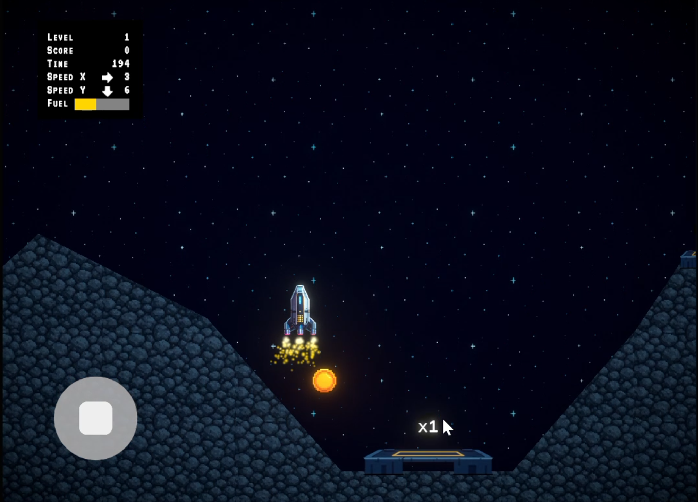
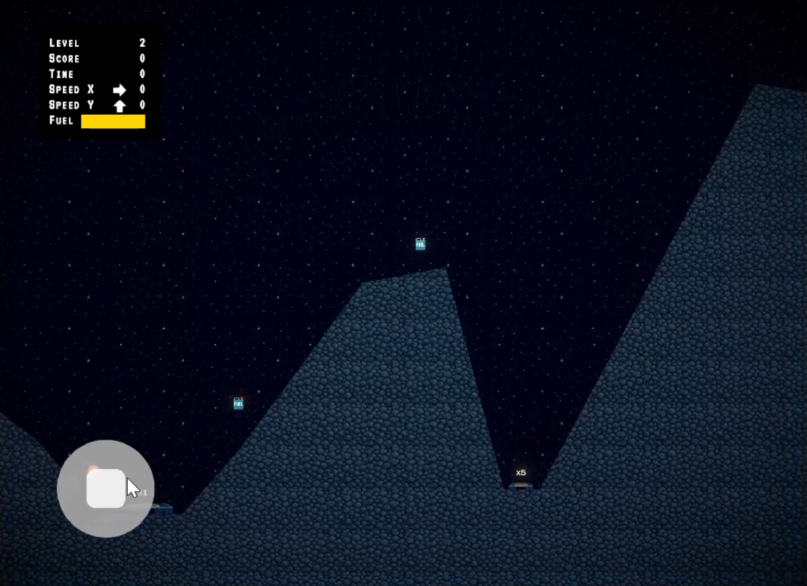
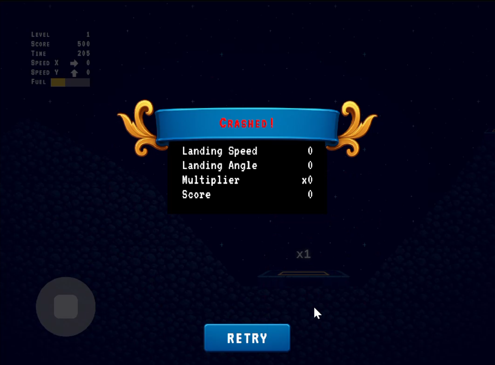
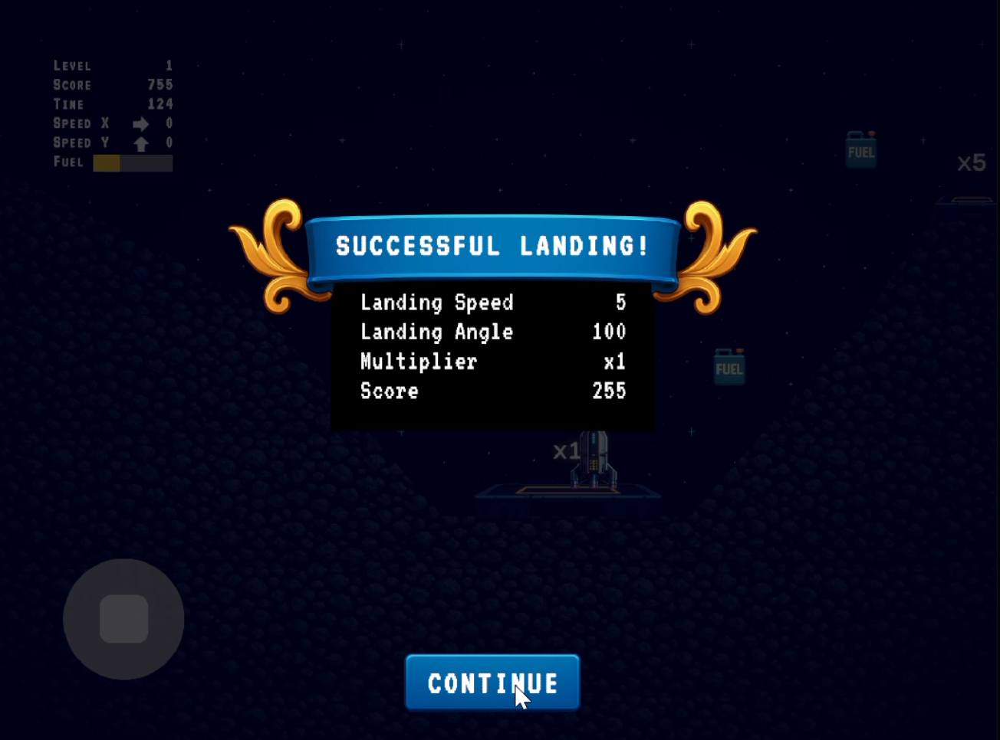

# Lua Lander 2D
A 2D Finite Physics-based landing game built in Unity, where: - 

1. Realistic Physics-Based Mechanics for the Player’s Rocket. 

2. Skill-Focused Gameplay to make a good user experience. 

3. Progressive Difficulty increases as the level rises. 

4. 1x and 5x score multiplier Landing Pads. 

## Main Menu

## Level-1

## Level-2

## Crashed

## Successful Landing

## Game Over
